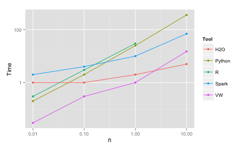
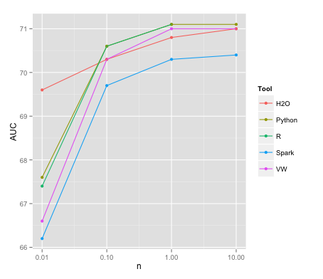
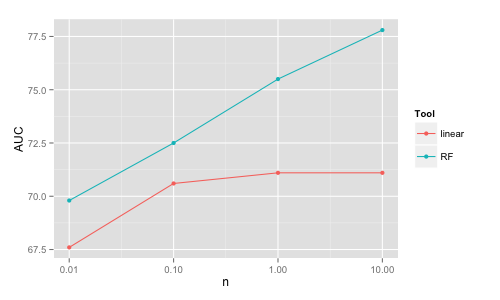
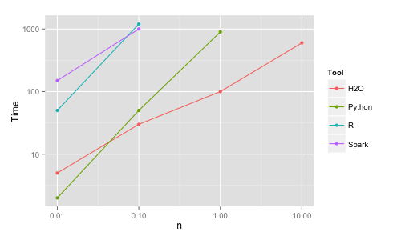
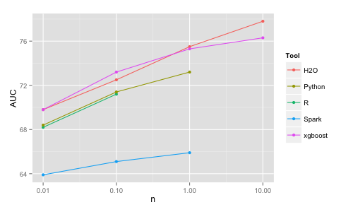
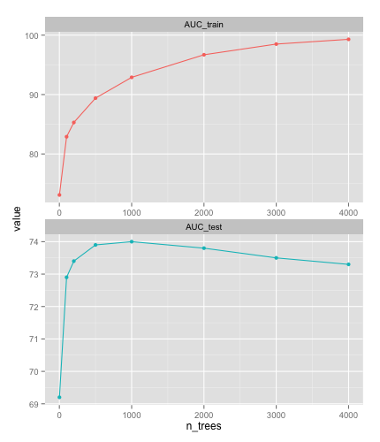
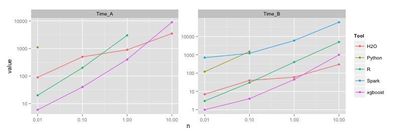
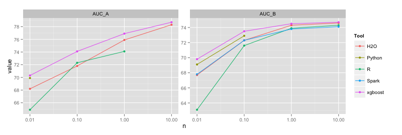

## Simple/limited/incomplete benchmark for scalability, speed and accuracy of machine learning libraries for classification

_**All benchmarks are wrong, but some are useful**_

This project aims at a *minimal* benchmark for scalability, speed and accuracy of commonly used implementations
of a few machine learning algorithms. The target of this study is binary classification with numeric and categorical inputs (of 
limited cardinality i.e. not very sparse) and no missing data, perhaps the most common problem in business
applications (e.g. credit scoring, fraud detection or churn prediction). If the input matrix is of *n* x *p*, *n* is 
varied as 10K, 100K, 1M, 10M, while *p* is ~1K (after expanding the categoricals into dummy 
variables/one-hot encoding). This particular type of data structure/size (the largest) stems from this author's interest in 
some particular business applications.

**Note:** While a large part of this benchmark was done in Spring 2015 reflecting the state of ML implementations at that time,
this repo is being updated if I see significant changes in implementations or new implementations have become widely
available (e.g. lightgbm). **Also, please find a summary of the progress and learnings from this benchmark at the 
[end](https://github.com/szilard/benchm-ml#summary) of this repo.**

The algorithms studied are 
- linear (logistic regression, linear SVM)
- random forest
- boosting 
- deep neural network

in various commonly used open source implementations like 
- R packages
- Python scikit-learn
- Vowpal Wabbit
- H2O 
- xgboost
- lightgbm (added in 2017)
- Spark MLlib.

**Update (June 2015):** It turns out these are the [most popular tools](https://github.com/szilard/list-ml-tools)
used for machine learning indeed. If your software tool of choice is not here, you can do a minimal benchmark
with little work with the [following instructions](z-other-tools).

Random forest, boosting and more recently deep neural networks are the algos expected to perform the best on the structure/sizes
described above (e.g. vs alternatives such as *k*-nearest neighbors, naive-Bayes, decision trees, linear models etc). 
Non-linear SVMs are also among the best in accuracy in general, but become slow/cannot scale for the larger *n*
sizes we want to deal with. The linear models are less accurate in general and are used here only 
as a baseline (but they can scale better and some of them can deal with very sparse features, so they are great in other use cases). 

By scalability we mean here that the algos are able to complete (in decent time) for the given data sizes with 
the main constraint being RAM (a given algo/implementation will crash if running out of memory). Some 
of the algos/implementations can work in a distributed setting, although the largest dataset in this
study *n* = 10M is less than 1GB, so scaling out to multiple machines should not be necessary and
is not the focus of this current study. (Also, some of the algos perform relatively poorly speedwise in the multi-node setting, where 
communication is over the network rather than via updating shared memory.)
Speed (in the single node setting) is determined by computational
complexity but also if the algo/implementation can use multiple processor cores.
Accuracy is measured by AUC. The interpretability of models is not of concern in this project.

In summary, we are focusing on which algos/implementations can be used to train relatively accurate binary classifiers for data
with millions of observations and thousands of features processed on commodity hardware (mainly one machine with decent RAM and several cores).

## Data

Training datasets of sizes 10K, 100K, 1M, 10M are [generated](0-init/2-gendata.txt) from the well-known airline dataset (using years 2005 and 2006). 
A test set of size 100K is generated from the same (using year 2007). The task is to predict whether a flight will
be delayed by more than 15 minutes. While we study primarily the scalability of algos/implementations, it is also interesting
to see how much more information and consequently accuracy the same model can obtain with more data (more observations).

## Setup 

The tests have been carried out on a Amazon EC2 c3.8xlarge instance (32 cores, 60GB RAM). The tools are freely available and 
their [installation](0-init/1-install.md) is trivial ([version information here](0-init/1a-versions.txt)). For some
of the models that ran out of memory for the larger data sizes a r3.8xlarge instance (32 cores, 250GB RAM) has been used
occasionally. For deep learning on GPUs, p2.xlarge (1 GPU with 12GB video memory, 4 CPU cores, 60GB RAM) instance has been used.

**Update (January 2018):** A more modern approach would use docker for fully automated installing of all ML software and automated
timing/running of tests (which would make it more easy to rerun the tests on new versions of the tools, would make them more reproducible etc).
This approach has been actually used in a leaner version of this benchmark on the top performing GBM implementations, see 
[here](https://github.com/szilard/GBM-perf).

## Results

For each algo/tool and each size *n* we observe the following: training time, maximum memory usage during training, CPU usage on the cores, 
and AUC as a measure for predictive accuracy. 
Times to read the data, pre-process the data, score the test data are also observed but not
reported (not the bottleneck).

### Linear Models

The linear models are not the primary focus of this study because of their not so great accuracy vs
the more complex models (on this type of data). 
They are analyzed here only to get some sort of baseline.

The R glm function (the basic R tool for logistic regression) is very slow, 500 seconds on *n* = 0.1M (AUC 70.6).
Therefore, for R the glmnet package is used. For Python/scikit-learn LogisticRegression
(based on the LIBLINEAR C++ library) has been used.

Tool    | *n*  |   Time (sec)  | RAM (GB) | AUC
--------|------|---------------|----------|--------
R       | 10K  |      0.1      |   1      | 66.7
.       | 100K |      0.5      |   1      | 70.3
.       | 1M   |      5        |   1      | 71.1
.       | 10M  |      90       |   5      | 71.1
Python  | 10K  |      0.2      |   2      | 67.6
.       | 100K |       2       |   3      | 70.6
.       | 1M   |       25      |   12     | 71.1
.       | 10M  |  crash/360    |          | 71.1
VW      | 10K  |     0.3 (/10) |          | 66.6
.       | 100K |      3 (/10)  |          | 70.3
.       | 1M   |      10 (/10) |          | 71.0
.       | 10M  |     15        |          | 71.0
H2O     | 10K  |      1        |   1      | 69.6
.       | 100K |      1        |   1      | 70.3
.       | 1M   |      2        |   2      | 70.8
.       | 10M  |      5        |   3      | 71.0
Spark   | 10K  |      1        |   1      | 66.6
.       | 100K |      2        |   1      | 70.2
.       | 1M   |      5        |   2      | 70.9
.       | 10M  |      35       |   10     | 70.9

Python crashes on the 60GB machine, but completes
when RAM is increased to 250GB (using a [sparse format](https://github.com/szilard/benchm-ml/issues/27) 
would help with memory footprint
and likely runtime as well).
The Vowpal Wabbit (VW) running times are reported in the table for 10 passes (online learning) 
over the data for 
the smaller sizes. While VW can be run on multiple cores (as multiple processes communicating with each
other), it has been run here in 
the simplest possible way (1 core). Also keep in mind that VW reads the data on the fly while for the other tools
the times reported exclude reading the data into memory.

One can play with various parameters (such as regularization) and even do some search in the parameter space with
cross-validation to get better accuracy. However, very quick experimentation shows that at least for the larger
sizes regularization does not increase accuracy significantly (which is expected since *n* >> *p*).

The main conclusion here is that **it is trivial to train linear models even for *n* = 10M rows virtually in
any of these tools** on a single machine in a matter of seconds. 
H2O and VW are the most memory efficient (VW needs only 1 observation in memory
at a time therefore is the ultimately scalable solution). H2O and VW are also the fastest (for VW the time reported
includes the time to read the data as it is read on the fly).
Again, the differences in memory efficiency and speed will start to really matter only for
larger sizes and beyond the scope of this study.

#### Learning Curve of Linear vs Non-Linear Models

For *this dataset* the accuracy of the linear
model tops-off at moderate sizes while the accuracy of non-linear models (e.g. random forest) 
continues to increase with increasing data size.
This is because a simple linear structure can be extracted already from 
a smaller dataset and having more data points will not change the classification boundary significantly.
On the other hand, more complex models such as random forests can improve further with increasing 
data size by adjusting further the classification boundary.

This means that having more data ("big data") does not improve further the accuracy of the *linear* model
(at least for this dataset).

Note also that the random forest model is more accurate than the linear one for any size, and 
contrary to the conventional wisdom of "more data beats better algorithms", 
the random forest model 
on 1% of the data (100K records) beats the linear model on all the data (10M records). 

Similar behavior can be observed in other *non-sparse* datasets, e.g. the 
[Higgs dataset](x1-data-higgs). Contact me (e.g. submit a [github issue](https://github.com/szilard/benchm-ml/issues)) 
if you have learning curves for linear vs non-linear models on other datasets (dense or sparse).

On the other hand, there is certainly a price for higher accuracy in terms of larger required training (CPU) time.

Ultimately, there is a data size - algo (complexity) - cost (CPU time) - accuracy tradeoff 
(to be studied in more details later). Some quick results for H2O:

n     |  Model  |  Time (sec) |   AUC 
------|---------|-------------|--------
10M   |  Linear |    5        |   71.0  
0.1M  |  RF     |    150      |   72.5
10M   |  RF     |    4000     |   77.8

### Random Forest

**Note:** The random forests results have been published in a more organized and self-contained form
in [this blog post](http://datascience.la/benchmarking-random-forest-implementations/).

Random forests with 500 trees have been trained in each tool choosing the default of square root of *p* as the number of
variables to split on.

Tool    | *n*  |   Time (sec)  | RAM (GB) | AUC
-------------------------|------|---------------|----------|--------
R       | 10K  |      50       |   10     | 68.2
.       | 100K |     1200      |   35     | 71.2
.       | 1M   |     crash     |          |
Python  | 10K  |      2        |   2      | 68.4
.       | 100K |     50        |   5      | 71.4
.       | 1M   |     900       |   20     | 73.2
.       | 10M  |     crash     |          |
H2O     | 10K  |      15       |   2      | 69.8
.       | 100K |      150      |   4      | 72.5
.       | 1M   |      600      |    5     | 75.5
.       | 10M  |     4000      |   25     | 77.8
Spark   | 10K  |      50       |   10     | 69.1
.       | 100K |      270      |   30     | 71.3
.       | 1M   |  crash/2000   |          | 71.4
xgboost | 10K  |     4         |    1     | 69.9
.       | 100K |    20         |    1     | 73.2
.       | 1M   |    170        |    2     | 75.3
.       | 10M  |    3000       |    9     | 76.3

The [R](2-rf/1.R) implementation (randomForest package) is slow and inefficient in memory use. 
It cannot cope by default with a large number of categories, therefore the data had
to be one-hot encoded. The implementation uses 1 processor core, but with 2 lines of extra code
it is easy to build
the trees in parallel using all the cores and combine them at the end. However, it runs out
of memory already for *n* = 1M. I have to emphasize this has nothing to do with R per se (and I still stand by
arguing R is the best data science platform esp. when it comes to data munging of structured data or
visualization), it is just this
particular (C and Fortran) RF implementation used by the randomForest package that is inefficient.

The [Python](2-rf/2.py) (scikit-learn) implementation is faster, more memory efficient and uses all the cores.
Variables needed to be one-hot encoded (which is more involved than for R) 
and for *n* = 10M doing this exhausted all the memory. Even if using a larger machine
with 250GB of memory (and 140GB free for RF after transforming all the data) the Python implementation
runs out of memory and crashes for this larger size. The algo 
[finished successfully](https://github.com/szilard/benchm-ml/issues/1) 
though when run on the larger box with simple integer encoding (which
for some datasets/cases might be actually a good approximation/choice).

The [H2O](2-rf/4-h2o.R) implementation is fast, memory efficient and uses all cores. It deals
with categorical variables automatically. It is also more accurate than the studied R/Python packages, 
which may be because
of dealing properly with the categorical variables, i.e. internally in the algo
rather than working from a previously 1-hot encoded dataset (where the link between the dummies 
belonging to the same original variable is lost).

[Spark](2-rf/5b-spark.txt) (MLlib) implementation is slower and has a larger memory footprint.
It runs out of memory already at *n* = 1M (with 250G of RAM it finishes for *n* = 1M, 
but it crashes for *n* = 10M). However, as Spark
can run on a cluster one can throw in even more RAM by using more nodes.
I also tried to provide the categorical
variables encoded simply as integers and passing the `categoricalFeaturesInfo` parameter, but that made
training much slower.
A convenience issue, reading the data is more than one line of code and at the start of this benchmark project
Spark did not provide a one-hot encoder
for the categorical data (therefore I used R for that). This has been ammnded since, thanks @jkbradley
for native 1-hot encoding [code](https://github.com/szilard/benchm-ml/blob/a04f7136438598ce700c3adbb0fee2efa29488f3/z-other-tools/5xa-spark-1hot.txt).
In earlier versions of this benchmark there was an issue of Spark random forests having
low prediction accuracy vs the other methods. This was due to aggregating votes rather than probabilities
and it has been addressed by @jkbradley in this 
[code](https://github.com/szilard/benchm-ml/blob/master/2-rf/5b-spark.txt#L64) (will be included in next Spark release).
There is still an open issue on the accuracy for *n* = 1M (see the breaking trend in the AUC graph).
To get more insights on the issues above see
[more comments](http://datascience.la/benchmarking-random-forest-implementations/#comment-53599) 
by Joseph Bradley @jkbradley of Databricks/Spark project (thanks, Joseph).

**Update (September 2016):** Spark 2.0 introduces a new API (Pipelines/"Spark ML" vs "Spark MLlib") and the 
[code](https://github.com/szilard/benchm-ml/blob/406a00e9e501405589d234607e56f64a35ab1ddf/z-other-tools/5xb-spark-trainpred--sp20.txt) becomes significantly simpler.
Furthermore, Spark 1.5, 1.6 and 2.0 introduced several optimizations ("Tungsten") that have improved significantly for example the speed on queries (SparkSQL).
However, there is no speed improvement for random forests, they actually got a bit 
[slower](https://github.com/szilard/benchm-ml/tree/master/z-other-tools#how-to-benchmark-your-tool-of-choice-with-minimal-work).

I also tried [xgboost](2-rf/6-xgboost.R), a popular library for boosting which is capable to build 
random forests as well. It is fast, memory efficient and of high accuracy. Note the different shapes of the
AUC and runtime vs dataset size curves for H2O and xgboost, some discussions 
[here](https://github.com/szilard/benchm-ml/issues/14).

Both H2O and xgboost have interfaces from R and Python.

A few other RF implementations (open source and commercial as well) 
have been benchmarked quickly on 1M records and runtime and AUC are 
[reported here](z-other-tools).

It would be nice to study the dependence of running time and accuracy as a function of
the (hyper)parameter values of the algorithm, but a quick idea can be obtained easily for the
H2O implementation from this table (*n* = 10M on 250GB RAM):

ntree    | depth  |   nbins  | mtries  | Time (hrs)   |  AUC
---------|--------|----------|---------|--------------|--------
500      |  20    |    20    | -1 (2)  |      1.2     |  77.8 
500      |  50    |    200   | -1 (2)  |      4.5     |  78.9
500      |  50    |    200   |   3     |      5.5     |  78.9
5000     |  50    |    200   | -1 (2)  |      45      |  79.0
500      |  100   |   1000   | -1 (2)  |      8.3     |  80.1

other hyperparameters being sample rate (at each tree), min number of observations in nodes, impurity
function.

One can see that the AUC could be improved further and the best AUC from this dataset with random forests
seems to be around 80 (the best AUC from linear models seems to be around 71, and we will compare
with boosting and deep learning later).

### Boosting (Gradient Boosted Trees/Gradient Boosting Machines)

Compared to random forests, GBMs have a more complex relationship between hyperparameters
and accuracy (and also runtime). The main hyperparameters are learning (shrinkage) rate, number of trees, 
max depth of trees, while some others are number of bins, sample rate (at each tree), min number of 
observations in nodes. To add to complexity, GBMs can overfit in the sense that adding more trees at some point will
result in decreasing accuracy on a test set (while on the training set "accuracy" keeps increasing).

For example using xgboost for `n = 100K` `learn_rate = 0.01` `max_depth = 16` (and the
`printEveryN = 100` and `eval_metric = "auc"` options) the AUC on the train and test sets,
respectively after `n_trees` number of iterations are:

One can see the AUC on the test set decreases after 1000 iterations (overfitting). 
xgboost has a handy early stopping option (`early_stop_round = k` - training
will stop if performance e.g. on a holdout set keeps getting worse consecutively 
for `k` rounds). If one does not know where to stop, one might underfit (too few iterations)
or overfit (too many iterations) and the resulting model will be suboptimal in accuracy
(see Fig. above).

Doing an extensive search for the best model is not the main goal of this project.
Nevertheless, a quick 
[exploratory search](https://github.com/szilard/benchm-ml/blob/master/3-boosting/0-xgboost-init-grid.R) 
in the hyperparameter space has been
conducted using xgboost (with the early stopping option). For this a separate validation
set of size 100K from 2007 data not used in the test set has been generated. The goal is
to find parameter values that provide decent accuracy and then run all GBM implementations
(R, Python scikit-learn, etc) with those parameter values to compare speed/scalability (and 
accuracy).

The smaller the `learn_rate` the better the AUC, but for very small values training time increases dramatically, 
therefore we use `learn_rate = 0.01` as a compromise. 
Unlike recommended in much of the literature, shallow trees don't produce best (or close to best) results, 
the grid search showed better accuracy e.g. with `max_depth = 16`.
The number of trees to produce optimal results for the above hyperparameter values depend though on the training set size. 
For `n_trees = 1000` we don't reach the overfitting regime
for either size and we use this value for studying the speed/scalability of the different implementations. 
(Values for the other hyper-parameters that seem to work well are: 
`sample_rate = 0.5` `min_obs_node = 1`.) We call this experiment A (in the table below).

Unfortunately some implementations take too much time to run for the above parameter values
(and Spark runs out of memory). Therefore, another set of parameter values (that provide lower accuracy but faster training times)
has been also used to study speed/scalability: `learn_rate = 0.1` `max_depth = 6` `n_trees = 300`. 
We call this experiment B.

I have to emphasize that while I make the effort to match parameter values for all algos/implementations,
every implementation is different, some don't have all the above parameters, while some might
use the existing ones in a slightly different way (you can also see the resulting model/AUC is somewhat different).
Nevertheless, the results below give us a pretty good idea of how the implementations compare to each other.

Tool    | *n*  | Time (s) A    | Time (s) B | AUC A  | AUC B  | RAM(GB) A | RAM(GB) B
--------|------|---------------|------------|--------|--------|-----------|-----------
R       | 10K  |   20          |   3        |   64.9 |  63.1  |    1      |     1
.       | 100K |   200         |   30       |   72.3 |  71.6  |    1      |     1
.       | 1M   |   3000        |   400      |   74.1 |  73.9  |    1      |     1
.       | 10M  |               |   5000     |        |  74.3  |           |     4
Python  | 10K  |    1100       |    120     |   69.9 |  69.1  |    2      |     2
.       | 100K |               |   1500     |        |  72.9  |           |     3
.       | 1M   |               |            |        |        |           |
.       | 10M  |               |            |        |        |           |
H2O     | 10K  |    90         |    7       |  68.2  |  67.7  |    3      |   2
.       | 100K |   500         |    40      |  71.8  |  72.3  |    3      |   2
.       | 1M   |   900         |    60      |  75.9  |  74.3  |    9      |   2
.       | 10M  |   3500        |    300     |  78.3  |  74.6  |    11     |   20
Spark   | 10K  |  180000       |   700      |  66.4  |  67.8  |    30     |   10
.       | 100K |               |   1200     |        |  72.3  |           |   30
.       | 1M   |               |   6000     |        |  73.8  |           |   30 
.       | 10M  |               |   (60000)  |        | (74.1) |           | crash (110) 
xgboost | 10K  |   6           |     1      |  70.3  |  69.8  |   1       |  1
.       | 100K |   40          |     4      |  74.1  |  73.5  |   1       |  1
.       | 1M   |   400         |     45     |  76.9  |  74.5  |   1       |  1
.       | 10M  |   9000        |    1000    |  78.7  |  74.7  |   6       |  5

The memory footprint of GBMs is in general smaller than for random forests, therefore the
bottleneck is mainly training time (although besides being slow Spark is inefficient in memory use as well
especially for deeper trees, therefore it crashes).

Similar to random forests, H2O and xgboost are the fastest (both use
multithreading). R does relatively well considering that it's a single-threaded implementation.
Python is very slow with one-hot encoding of categoricals, but almost as fast as R (just 1.5x slower) with
simple/integer encoding. Spark is slow and memory inefficient,
but at least for shallow trees it achieves similar accuracy to the other methods (unlike in
the case of random forests, where Spark provides lower accuracy than
its peers).

Compared to random forests, boosting requires more tuning to get a good choice of hyperparameters.
Quick results for H2O and xgboost with `n = 10M` (largest data)
`learn_rate = 0.01` (the smaller the better
AUC, but also longer and longer training times) `max_depth = 20` (after rough search with 
`max_depth = 2,5,10,20,50`) `n_trees = 5000` (close to xgboost early stop)
`min_obs_node = 1` (and `sample_rate = 0.5` for xgboost, `n_bins = 1000` for H2O):

Tool    |  Time (hr) |   AUC
--------|------------|---------
H2O     |   7.5      |   79.8
H2O-3   |   9.5      |   81.2
xgboost |   14       |   81.1

Compare with H2O random forest from previous section (Time 8.3	hr, AUC 80.1).
H2O-3 is the new generation/version of H2O. 

**Update (May 2017):** A new tool for GBMs, LightGBM came out recently. While it's not (yet) as widely used as the tools above,
it is now the fastest one. There is also recent work in running xgboost and LightGBM on GPUs. Therefore I started a new 
(leaner) github repo to keep track of the best GBM tools 
[here](https://github.com/szilard/GBM-perf) (and ignore mediocre tools such as Spark).

**Update (January 2018)**: I dockerized the GBM measurements for h2o, xgboost and lightgbm (both CPU and GPU versions). The repo linked in 
the paragraph above will contain all further development w.r.t. GBM implementations. GBMs are typically the most accurate algos
for supervised learning on structured/tabular data and therefore of my main interest 
(e.g. compared with the other 3 algos discussed in this current benchmark - linear models, random forests and neural networks), 
and the dockerization makes it easier to keep that other repo up to date with tests on the newest versions of the tools and
potentially adding new ML tools. **Therefore this new [GBM-perf](https://github.com/szilard/GBM-perf) repo can be considered as
a "successor" of the current one.**

### Deep neural networks

Deep learning has been extremely successful on a few classes of data/machine learning problems such as involving images, 
speech and text (supervised learning) and games (reinforcement learning).
However, it seems that in "traditional" machine learning problems such as fraud detection, credit scoring or churn,
deep learning is not as successful and it provides lower accuracy than random forests or gradient boosting machines. 
My experiments (November 2015) on the airline dataset used in this repo and also on another 
commercial dataset have [conjectured](https://github.com/szilard/benchm-ml/issues/28) this, 
but unfortunately most of the hype surrounding deep learning and "artificial intelligence" overwhelms this reality,
and there are only a few references in this direction e.g. 
[here](https://www.quora.com/Why-is-xgboost-given-so-much-less-attention-than-deep-learning-despite-its-ubiquity-in-winning-Kaggle-solutions/answer/Tianqi-Chen-1),
[here](https://speakerdeck.com/datasciencela/tianqi-chen-xgboost-implementation-details-la-workshop-talk?slide=28)
or [here](https://www.youtube.com/watch?v=8KzjARKIgTo#t=28m15s).

Here are the results of a few fully connected network architectures 
[trained](4-DL/1-h2o.R)
with various optimization schemes (adaptive, rate annealing, momentum etc.) 
and various regularizers (dropout, L1, L2) 
using H2O with early stopping on the 10M dataset:

Params                                                               |  AUC  |  Time (s) | Epochs 
---------------------------------------------------------------------|-------|-----------|----------
default: `activation = "Rectifier", hidden = c(200,200)`             | 73.1  |    270    |  1.8
`hidden = c(50,50,50,50), input_dropout_ratio = 0.2`                 | 73.2  |    140    |  2.7
`hidden = c(50,50,50,50)`                                            | 73.2  |    110    |  1.9
`hidden = c(20,20)`                                                  | 73.1  |    100    |  4.6
`hidden = c(20)`                                                     | 73.1  |    120    |  6.7
`hidden = c(10)`                                                     | 73.2  |    150    |  12
`hidden = c(5)`                                                      | 72.9  |    110    |  9.3
`hidden = c(1)` (~logistic regression)                               | 71.2  |    120    |  13
`hidden = c(200,200), l1 = 1e-5, l2 = 1e-5`                          | 73.1  |    260    |  1.8
`RectifierWithDropout, c(200,200,200,200), dropout=c(0.2,0.1,0.1,0)` | 73.3  |    440    |  2.0
`ADADELTA rho = 0.95, epsilon = 1e-06`                               | 71.1  |    240    |  1.7
` rho = 0.999, epsilon = 1e-08`                                      | 73.3  |    270    |  1.9
`adaptive = FALSE` default: `rate = 0.005, decay = 1, momentum = 0`  | 73.0  |    340    |  1.1
`rate = 0.001, momentum = 0.5 / 1e5 / 0.99`                          | 73.2  |    410    |  0.7
`rate = 0.01, momentum = 0.5 / 1e5 / 0.99`                           | 73.3  |    280    |  0.9
`rate = 0.01, rate_annealing = 1e-05, momentum = 0.5 / 1e5 / 0.99`   | 73.5  |    360    |  1
`rate = 0.01, rate_annealing = 1e-04, momentum = 0.5 / 1e5 / 0.99`   | 72.7  |    3700   |  8.7
`rate = 0.01, rate_annealing = 1e-05, momentum = 0.5 / 1e5 / 0.9`    | 73.4  |    350    |  0.9

It looks like the neural nets are underfitting and are not able to capture the same structure in the
data as the random forests/GBMs can (AUC 80-81). Therefore adding various forms of regularization
does not improve accuracy (see above). Note also that by using early stopping (based on the decrease of
accuracy on a validation dataset during training iterations) the training takes relatively short time
(compared to RF/GBM), also a sign of effectively low model complexity.
Remarkably, the nets with more layers (deep) are not performing better than a simple net with
1 hidden layer and a small number of neurons in that layer (10). 

Timing on the 1M dataset of various tools (fully connected networks, 2 hidden layers, 200 neurons each, ReLU,  
SGD, learning rate 0.01, momentum 0.9, 1 epoch), code 
[here](https://github.com/szilard/benchm-ml/tree/master/4-DL):

Tool         | Time GPU  | Time CPU
-------------|-----------|-----------
h2o          |    -      |   50
mxnet        |    35     |   65
keras+TF     |    35     |   60
keras+theano |    25     |   70

(GPU = p2.xlarge, CPU = r3.8xlarge 32c for h2o/mxnet, p2.xlarge 4c for TF/theano, theano uses 1 core only)

Despite not being great (in accuracy) on tabular data of the type above, 
deep learning has been a blast in domains such as image, speech and somewhat text,
and I'm planing to do a [benchmark of tools](https://github.com/szilard/benchm-dl) 
in that area as well (mostly conv-nets and RNNs/LSTMs).

### Big(ger) Data

While my primary interest is in machine learning on datasets of 10M records, you might be interested in 
larger datasets. Some problems might need a cluster, though there has been a tendency recently 
to solve every problem with distributed computing, needed or not. As a reminder, sending data
over a network vs using shared memory is a big speed difference. Also several popular distributed systems
have significant computation and memory overhead, and more fundamentally, their communication patterns
(e.g. map-reduce style) are not the best fit for many of the machine learning algos.

#### Larger Data Sizes (on a Single Server)

For linear models, most tools, including single-core R work well on 100M records still
on a single server (r3.8xlarge instance with 32 cores, 250GB RAM used here).
(A 10x copy of the 10M dataset has been used, therefore information on AUC vs size is invalid
and is not considered here.)

Linear models, 100M rows:

Tool    |   Time[s]   |   RAM[GB]
--------|-------------|-----------
R       |   1000      |    60
Spark   |    160      |    120
H2O     |    40       |    20
VW      |    150      |

Some tools can handle 1B records on a single machine
(in fact VW never runs out of memory, so if larger runtimes are acceptable,
you can go further still on one machine).

Linear models, 1B rows:

Tool    |   Time[s]   |   RAM[GB]
--------|-------------|-----------
H2O     |    500      |    100
VW      |    1400     |

For tree-based ensembles (RF, GBM) H2O and xgboost can train on 100M records
on a single server, though the training times become several hours:

RF/GBM, 100M rows:

Algo    |Tool     |   Time[s]   |   Time[hr]  | RAM[GB]
--------|---------|-------------|-------------|----------
RF      | H2O     |   40000     |     11      | 80
.       | xgboost |   36000     |     10      | 60
GBM     | H2O     |   35000     |     10      | 100   
.       | xgboost |   110000    |     30      | 50

One usually hopes here (and most often gets) much better accuracy for the 1000x in training time vs linear models.

#### Distributed Systems

Some quick results:

H2O logistic runtime (sec):

size    |  1 node |  5 nodes
--------|---------|----------
100M    |   42    |   9.9 
1B      |  480    |   101 

H2O RF runtime (sec) (5 trees):

size    |  1 node |  5 nodes
--------|---------|----------
10M     |   42    |   41     
100M    |  405    |   122

## Summary

As of January 2018:

When I started this benchmark in March 2015, the "big data" hype was all the rage, and the fanboys wanted to do
machine learning on "big data" with distributed computing (Hadoop, Spark etc.), while for the datasets most people had
single-machine tools were not only good enough, but also faster, with more features and less bugs. I gave quite a few
talks at conferences and meetups about these benchmarks starting 2015 
and while at the beginning I had several people asking angrily about my results on Spark, by 2017 most people realized single machine
tools are much better for solving most of their ML problems. While Spark is a decent tool for ETL on raw data (which 
often is indeed "big"), its ML libraries are totally garbage and outperformed (in training time, memory footpring and
even accuracy) by much better tools by orders of magnitude. 
Furthermore, the increase in available RAM over the last years in servers and also in the cloud,
and the fact that for machine learning one typically refines the raw data 
into a much smaller sized data matrix is making the mostly single-machine highly-performing tools 
(such as xgboost, lightgbm, VW but also h2o) the best choice for most 
practical applications now. The big data hype is finally over.

What's happening now is a new wave of hype, namely deep learning. The fanboys now think deep learning (or as they miscall it:
AI) is the best solution to all machine learning problems. While deep learning has been extremely
successful indeed on a few classes of data/machine learning problems such as involving images, 
speech and somewhat text (supervised learning) and games/virtual environments (reinforcement learning),
in more "traditional" machine learning problems encountered in business such as fraud detection, credit scoring or churn
(with structured/tabular data) deep learning is not as successful and it provides lower accuracy 
than random forests or gradient boosting machines (GBM). Therefore, lately I'm concentrating my benchmarking efforts 
mostly on GBM implementations and 
I have started a new github repo [GBM-perf](https://github.com/szilard/GBM-perf) that's more "focused" and lean 
and also uses more modern tools (such as docker) to make the benchmarks more maintainable and reproducible. Also, it has become
apparent recently that GPUs can be a powerful computing platform for GBMs too, and the new repo includes benchmarks 
of the available GPU implementations as well.

I started these benchmarks mostly out of curiousity and the desire to learn (and also in order to be able to choose 
good tools for my projects). It's been quite some experience and I'd like to thank all the folks (especially the developers of
the tools) for helping me in tuning and getting the most out of their ML tools. 
As a side effect of this work I had the pleasure to be invited to talk at several conferences
(KDD, R-finance, useR!, eRum, H2O World, Crunch, Predictive Analytics World, EARL, Domino Data Science Popup, Big Data Day LA,
Budapest Data Forum) and to over 10 meetups, e.g.:

- KDD **Invited Talk** - Machine Learning Software in Practice: Quo Vadis? - Halifax, Canada, August 2017
- R in Finance **Keynote** - No-Bullshit Data Science - Chicago, May 2017
- LA Data Science Meetup - Machine Learning in Production - Los Angeles, May 2017
- useR! 2016 - Size of Datasets for Analytics and Implications for R - Stanford, June 2016
- H2O World - Benchmarking open source ML platforms - Mountain View, November 2015
- LA Machine Learning Meetup - Benchmarking ML Tools for Scalability, Speed and Accuracy - LA, June 2015

(see code/slides and for some video recordings [here](https://github.com/szilard/benchm-ml-talks)). These talks/materials are also
probably the best place to get a grasp on the findings of this benchmark (and if you want to pick the one that is most
up to date and summarizes the most watch the 
[video of my KDD talk](https://www.youtube.com/watch?v=8wyOwUNw7D8&list=PLliTSxmRFGVO6Vag6FX5Jfq-RG-kUtKFZ&index=11)).
The work goes on, expect more results...

