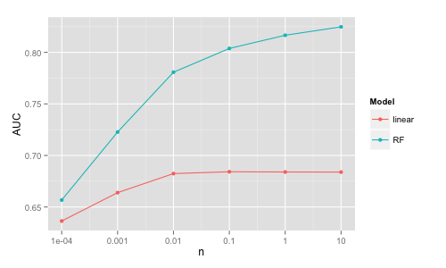

#### Experiments on the Higgs dataset

Binary classification of Higgs vs background with 11 million records and 28 numeric
features (simulated data) by Baldi etal https://archive.ics.uci.edu/ml/datasets/HIGGS.

Learning curves of linear (logistic regression) vs non-linear models (random forest
and deep learning):

The linear model is less accurate than the more complex ones and it tops-off in accuracy 
quickly. (The DL models have been trained without extensive search in the hyper-parameter space and
with the same hyper-parameter values accross
all the different sizes, therefore not necessarily optimal. TBD if better models can be obtained 
for the smaller data sizes.)

